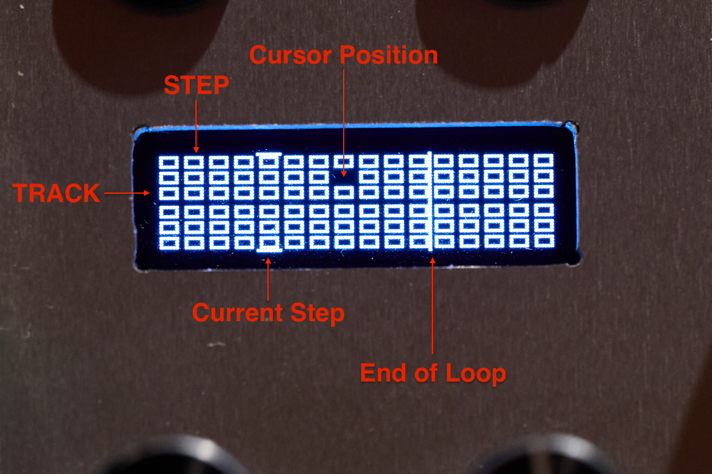
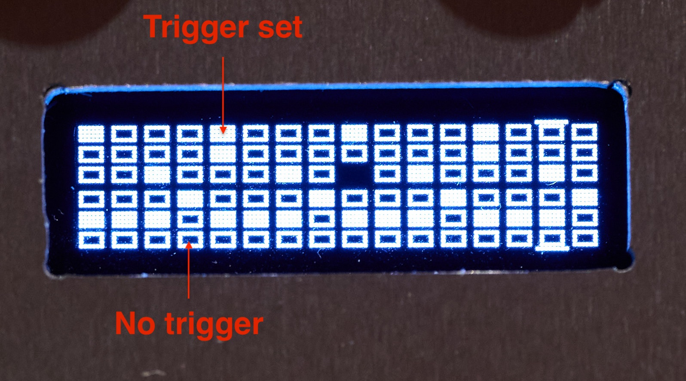

# Euro Pi Triggers - simple 6 track 8/16/24 step trigger sequencer for Euro Pi

author: Thomas Herrmann (github.com/thoherr)

date: 2023-02-14

labels: sequencer, trigger

## Overview

This script implements a simple trigger sequencer with an easy to use interface to change
the 6 sequences.

It makes full use of the limited resources on Euro Pi, esp. the outputs and screen real estate.

The total length of the sequence can be 8, 16 or 24 steps and can be changed on the fly.

The script saves the patterns, the current loop length and the total length as state.

The scrit requires a clock input at the digital port **din** to go to the next sequencer step.

## Screen

The screen shows the sequencer pattern, which is divided into 6 tracks (corresponding to the
6 CV outputs) and 8, 16 or 24 steps.

The initial screen looks like this:

Every row represents one track (1-6), which is routed to the corresponding output (cv1-cv6).

Every column represents one trigger step (advanced to the next step when *din* gets a signal).

The default mode is 16 steps, which is quite useful on the tiny display of the EuroPi.

You may, however, switch the number of steps to 24 (where the single step becomes **very**
tiny) or 8. This can be done by a long press (> 4 sec) of button 2.

The current cursor position is shown by a black rectangle. When the step under the cursor is activated,
it has a smaller white rectangle in the middle.

The cursor can be moved by turning knob 1 (switch between tracks) and knob 2 (switch between steps).

The current step is shown by two lines at the top and the bottom of the display. It advances when
there is a trigger input at *din*.

When you activate shorter loops by setting the end of the sequence (see below), the **end of loop**
is shown by a vertical line behind the last step.

Activated steps are shown as filled rectangles, as you can see in the next picture.

When a trigger is set at a step in a track, the corresponding position is shown as filled
rectangle.

## Inputs

| **Port** | **Description**  |
|----------|------------------|
| din      | clock (one step) |
| ain      | not used         |

## Controls

### Knobs

| **Knob** | **Function**                     |
|----------|----------------------------------|
| k1       | select track (1-6)               |
| k2       | select sequence step (1-8/16/24) |

### Buttons

| **Button** | **Press**       | **Function**                                 |
|------------|-----------------|----------------------------------------------|
| b1         | klick           | toggle step at cursor (on/off)               |
| b1         | short (1-3 sec) | clear all steps in current track             |
| b1         | long (> 4 sec)  | clear all steps                              |
| b2         | klick           | reset sequence to step 1                     |
| b2         | short (1-3 sec) | set end of sequence (loop end point)         |
| b2         | long (> 4 sec)  | switch to next sequence length (8, 16 or 24) |

## Outputs

| **Port** | **Description**                               |
|----------|-----------------------------------------------|
| cv1      | track 1 (high = on, low = of at current step) |
| cv2      | track 2 (high = on, low = of at current step) |
| cv3      | track 3 (high = on, low = of at current step) |
| cv4      | track 4 (high = on, low = of at current step) |
| cv5      | track 5 (high = on, low = of at current step) |
| cv6      | track 6 (high = on, low = of at current step) |

## Enhancements / Ideas

* Sequence length configurable per track. Problem here is probably the UI and the tiny display.
* Storable Patterns, i.e. not only save the current pattern. One possibility would be to use numberated file names?

